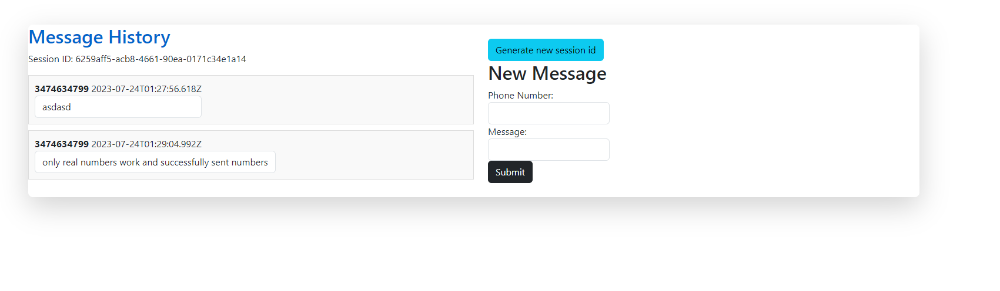

# README

Small messaging app that utilizes twilio api. 

Written with ruby on rails as backend and angular for frontend.

# PreReqs:
1. Ruby: 2.7.6p219 (2022-04-12 revision c9c2245c0a) [x64-mingw32]
2. Rails: 5.2.8.1
3. Node: v18.16.1

# Setup 
1. bundle install
2. rails server
3. cd city-messenger-frontend
4. npm install
5. ng serve

# Run
1. Go to localhost:4200
2. Enter in a valid phone number and message
3. Hit submit... Enjoy...